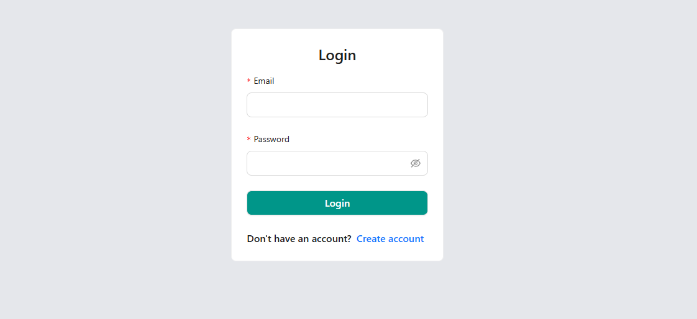
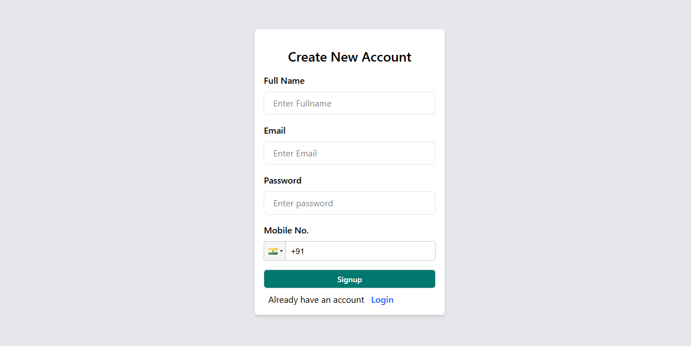
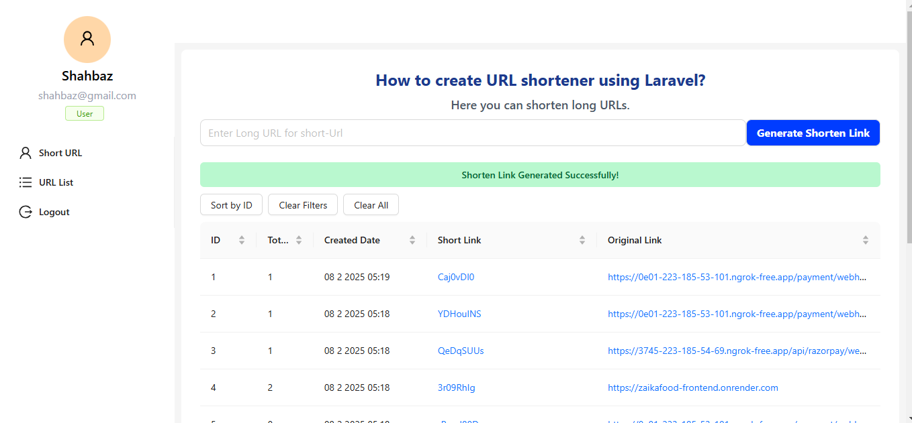
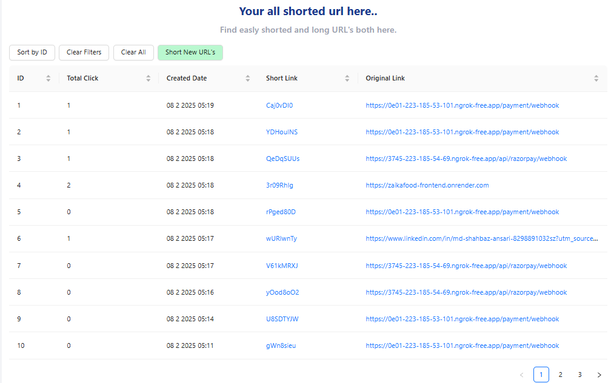

🚀 URL Shortener with Redis Caching

📌 Overview

A simple URL Shortener built with Node.js, Express, MongoDB, and Redis for caching. This project allows users to shorten URLs and track click analytics efficiently.

✨ Features

🔗 Shorten Long URLs

📊 Track Total Clicks

⚡ Faster Redirections using Redis Caching

📅 URL Creation Date Tracking

🛠️ API Support for Developers

🖼️ Screenshots

🛠️ Tech Stack

Frontend: React, Ant Design

Backend: Node.js, Express.js

Database: MongoDB (Mongoose ODM)

Caching: Redis (ioredis)

Hosting: Render.com

🚀 Setup Instructions

1️⃣ Clone the Repository

git clone https://github.com/your-username/url-shortener.git
cd url-shortener

2️⃣ Install Dependencies

npm install

3️⃣ Set Up Environment Variables

Create a .env file and add:

MONGO_URI=your-mongodb-url
REDIS_URL=your-redis-url
PORT=8080

4️⃣ Start the Server

npm start
nodemon

The server will run at http://localhost:8080

📡 API Endpoints

1️⃣ Shorten a URL

POST /api/url/shorten

{
"longUrl": "https://example.com"
}

Response:

{
"shortUrl": "http://localhost:8080/api/url/abc123"
}

2️⃣ Redirect to Original URL

GET /api/url/:shortId

Redirects the user to the original URL.

3️⃣ Get Analytics

GET /api/url/analytics/:userId

Returns all URLs created by a user with click counts.

👨‍💻 Contributors

Your Name - Full Stack Developer

🏗️ Future Enhancements

✅ Custom URL Aliases

✅ Expiry Dates for Short Links

✅ User Authentication for Secure Access

🖼️ Screenshots

### Homepage  

### URL Shortening Form  

### URL Analytics Page  

### URL Analytics Page  

📝 License

This project is open-source under the MIT License.

Feel free to 🌟 Star this repository and contribute! 🚀
